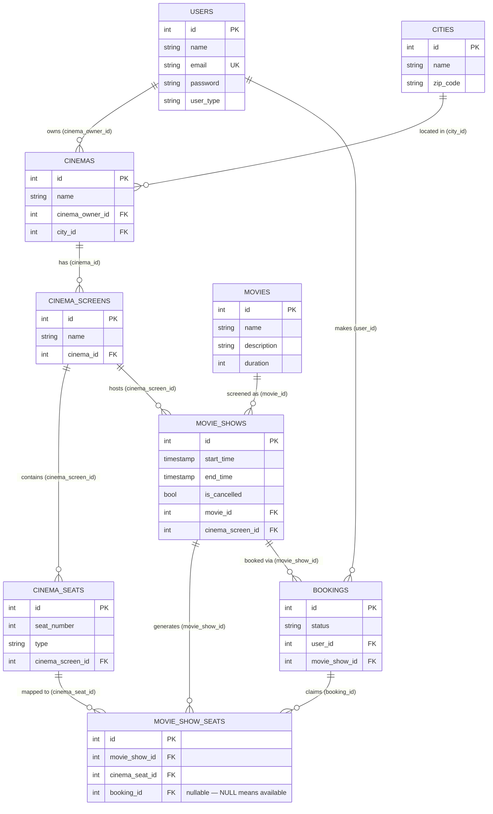

# Database Design

## Tables

---

### `users`

| Column       | Type         | Constraints                          |
|--------------|--------------|--------------------------------------|
| `id`         | int          | PK, auto-increment                   |
| `name`       | varchar      | NOT NULL                             |
| `email`      | varchar(191) | NOT NULL, UNIQUE INDEX               |
| `password`   | varchar      | NOT NULL                             |
| `user_type`  | varchar      | NOT NULL, default `REGULAR`          |
| `created_at` | timestamp    |                                      |
| `updated_at` | timestamp    |                                      |
| `deleted_at` | timestamp    | INDEX (soft delete)                  |

**Allowed `user_type` values:** `REGULAR`, `CINEMA_OWNER`, `ADMIN`

---

### `cities`

| Column       | Type      | Constraints         |
|--------------|-----------|---------------------|
| `id`         | int       | PK, auto-increment  |
| `name`       | varchar   | NOT NULL            |
| `zip_code`   | varchar   | NOT NULL            |
| `created_at` | timestamp |                     |
| `updated_at` | timestamp |                     |
| `deleted_at` | timestamp | INDEX (soft delete) |

---

### `cinemas`

| Column           | Type      | Constraints                     |
|------------------|-----------|---------------------------------|
| `id`             | int       | PK, auto-increment              |
| `name`           | varchar   | NOT NULL                        |
| `cinema_owner_id`| int       | FK → `users.id`                 |
| `city_id`        | int       | FK → `cities.id`                |
| `created_at`     | timestamp |                                 |
| `updated_at`     | timestamp |                                 |
| `deleted_at`     | timestamp | INDEX (soft delete)             |

---

### `cinema_screens`

| Column       | Type      | Constraints                                      |
|--------------|-----------|--------------------------------------------------|
| `id`         | int       | PK, auto-increment                               |
| `name`       | varchar   | NOT NULL, part of composite unique (see below)   |
| `cinema_id`  | int       | FK → `cinemas.id`, part of composite unique      |
| `created_at` | timestamp |                                                  |
| `updated_at` | timestamp |                                                  |
| `deleted_at` | timestamp | INDEX (soft delete)                              |

**Unique constraint:** `unique_screen_per_cinema` on `(name, cinema_id)` — a cinema cannot have two screens with the same name.

---

### `cinema_seats`

| Column             | Type      | Constraints                                    |
|--------------------|-----------|------------------------------------------------|
| `id`               | int       | PK, auto-increment                             |
| `seat_number`      | int       | NOT NULL, part of composite unique (see below) |
| `type`             | varchar   | NOT NULL                                       |
| `cinema_screen_id` | int       | FK → `cinema_screens.id`, part of composite unique |
| `created_at`       | timestamp |                                                |
| `updated_at`       | timestamp |                                                |
| `deleted_at`       | timestamp | INDEX (soft delete)                            |

**Unique constraint:** `unique_seat_per_screen` on `(seat_number, cinema_screen_id)` — seat numbers are globally sequential per screen (never reset between types), so this constraint is never violated.

**Allowed `type` values:** `RECLINER`, `PREMIUM`, `FRONT`, `BALCONY`

---

### `movies`

| Column        | Type      | Constraints         |
|---------------|-----------|---------------------|
| `id`          | int       | PK, auto-increment  |
| `name`        | varchar   | NOT NULL            |
| `description` | text      | NOT NULL            |
| `duration`    | int       | NOT NULL (minutes)  |
| `created_at`  | timestamp |                     |
| `updated_at`  | timestamp |                     |
| `deleted_at`  | timestamp | INDEX (soft delete) |

---

### `movie_shows`

| Column             | Type      | Constraints               |
|--------------------|-----------|---------------------------|
| `id`               | int       | PK, auto-increment        |
| `start_time`       | timestamp | NOT NULL                  |
| `end_time`         | timestamp | NOT NULL (derived: `start_time + movie.duration`) |
| `is_cancelled`     | bool      | NOT NULL, default `false` |
| `movie_id`         | int       | FK → `movies.id`          |
| `cinema_screen_id` | int       | FK → `cinema_screens.id`  |
| `created_at`       | timestamp |                           |
| `updated_at`       | timestamp |                           |
| `deleted_at`       | timestamp | INDEX (soft delete)       |

**Overlap guard:** `BeforeCreate` hook issues a `SELECT ... FOR UPDATE` to check that no existing show on the same screen has an overlapping `[start_time, end_time)` window. This makes the check-then-insert atomic under concurrent transactions.

**Auto seat generation:** `AfterCreate` hook creates one `movie_show_seats` row for every `cinema_seat` that belongs to the screen.

---

### `movie_show_seats`

| Column           | Type      | Constraints                                      |
|------------------|-----------|--------------------------------------------------|
| `id`             | int       | PK, auto-increment                               |
| `movie_show_id`  | int       | FK → `movie_shows.id`, part of composite unique  |
| `cinema_seat_id` | int       | FK → `cinema_seats.id`, part of composite unique |
| `booking_id`     | int       | FK → `bookings.id`, **nullable** (NULL = available) |
| `created_at`     | timestamp |                                                  |
| `updated_at`     | timestamp |                                                  |
| `deleted_at`     | timestamp | INDEX (soft delete)                              |

**Unique constraint:** `unique_seat_per_show` on `(movie_show_id, cinema_seat_id)` — each physical seat can appear at most once per show.

**Availability:** `booking_id IS NULL` means the seat is available. Seats are claimed via a conditional `UPDATE ... WHERE booking_id IS NULL` so concurrent booking requests race on the database constraint rather than application-level locking.

---

### `bookings`

| Column          | Type      | Constraints              |
|-----------------|-----------|--------------------------|
| `id`            | int       | PK, auto-increment       |
| `status`        | varchar   | NOT NULL                 |
| `user_id`       | int       | FK → `users.id`          |
| `movie_show_id` | int       | FK → `movie_shows.id`    |
| `created_at`    | timestamp |                          |
| `updated_at`    | timestamp |                          |
| `deleted_at`    | timestamp | INDEX (soft delete)      |

**Allowed `status` values:** `PENDING`, `CONFIRMED`, `FAILED`, `CANCELLED`

Both `CONFIRMED` and `FAILED` bookings are persisted as audit records. A `FAILED` booking means at least one requested seat was already claimed by a concurrent booking.

---

## Relationships

```
users
 ├── cinemas          (cinema_owner_id → users.id)
 └── bookings         (user_id        → users.id)

cities
 └── cinemas          (city_id        → cities.id)

cinemas
 └── cinema_screens   (cinema_id      → cinemas.id)

cinema_screens
 └── cinema_seats     (cinema_screen_id → cinema_screens.id)

movies
 └── movie_shows      (movie_id       → movies.id)

movie_shows
 ├── movie_show_seats (movie_show_id  → movie_shows.id)  [auto-created on show insert]
 └── bookings         (movie_show_id  → movie_shows.id)

cinema_seats
 └── movie_show_seats (cinema_seat_id → cinema_seats.id)

bookings
 └── movie_show_seats (booking_id     → bookings.id)     [nullable; NULL = available]
```

---

## Index Summary

| Table              | Index name                  | Columns                          | Type         |
|--------------------|-----------------------------|----------------------------------|--------------|
| `users`            | *(GORM default)*            | `email`                          | UNIQUE       |
| `users`            | *(GORM default)*            | `deleted_at`                     | INDEX        |
| `cities`           | *(GORM default)*            | `deleted_at`                     | INDEX        |
| `cinemas`          | *(GORM default)*            | `deleted_at`                     | INDEX        |
| `cinema_screens`   | `unique_screen_per_cinema`  | `(name, cinema_id)`              | UNIQUE       |
| `cinema_screens`   | *(GORM default)*            | `deleted_at`                     | INDEX        |
| `cinema_seats`     | `unique_seat_per_screen`    | `(seat_number, cinema_screen_id)`| UNIQUE       |
| `cinema_seats`     | *(GORM default)*            | `deleted_at`                     | INDEX        |
| `movies`           | *(GORM default)*            | `deleted_at`                     | INDEX        |
| `movie_shows`      | *(GORM default)*            | `deleted_at`                     | INDEX        |
| `movie_show_seats` | `unique_seat_per_show`      | `(movie_show_id, cinema_seat_id)`| UNIQUE       |
| `movie_show_seats` | *(GORM default)*            | `deleted_at`                     | INDEX        |
| `bookings`         | *(GORM default)*            | `deleted_at`                     | INDEX        |

---

## ER Diagram



> **Composite unique constraints** (not expressible as single-column keys above):
> - `CINEMA_SCREENS`: `(name, cinema_id)` — a cinema cannot have two screens with the same name
> - `CINEMA_SEATS`: `(seat_number, cinema_screen_id)` — seat numbers are unique within a screen
> - `MOVIE_SHOW_SEATS`: `(movie_show_id, cinema_seat_id)` — each physical seat appears at most once per show
